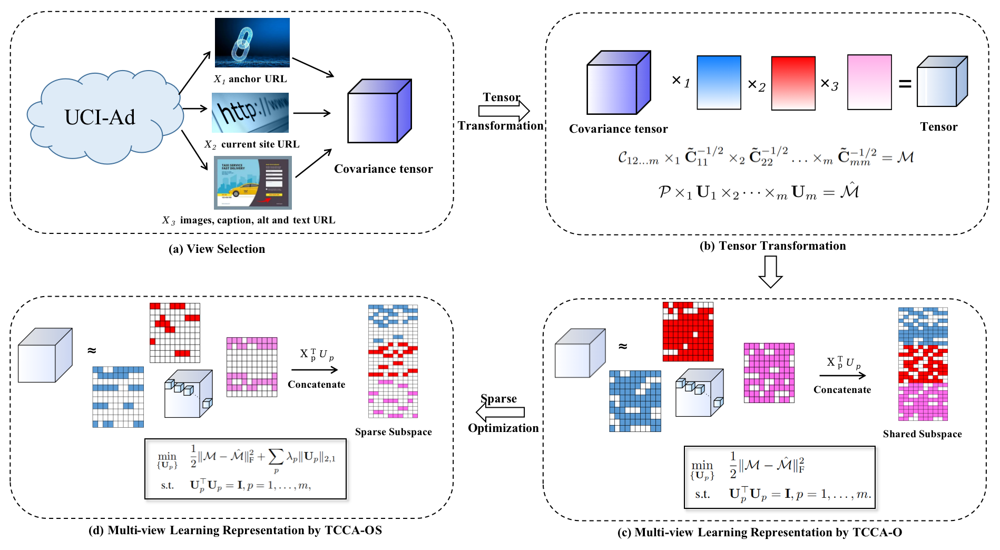

# Tensor Canonical Correlation Analysis with Orthogonality and Sparsity (TCCA-OS)
The code in this toolbox implements "Learning High-Order Multi-View Representation by New Tensor Canonical Correlation Analysis". More specifically, it is detailed as

### Quick Testing
---------------------
Directly run demo.

### Citation
---------------------
Please give credit to this paper if this code is useful and helpful for your research.

    @inproceedings{liang2021mutual,
      title={Mutual Affine Network for Spatially Variant Kernel Estimation in Blind Image Super-Resolution},
      author={Liang, Jingyun and Sun, Guolei and Zhang, Kai and Van Gool, Luc and Timofte, Radu},
      booktitle={IEEE International Conference on Computer Vision},
      year={2021}
    }

### Contact Information
---------------------
Danfeng Hong: xcxiu@shu.edu.cn 
Please feel free to contact me if you have any questions.
